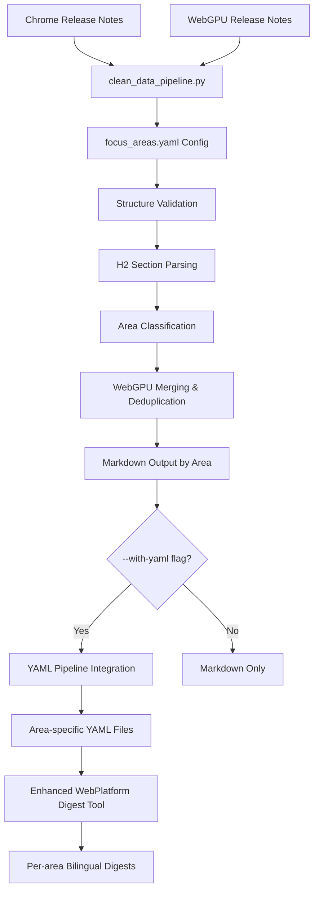
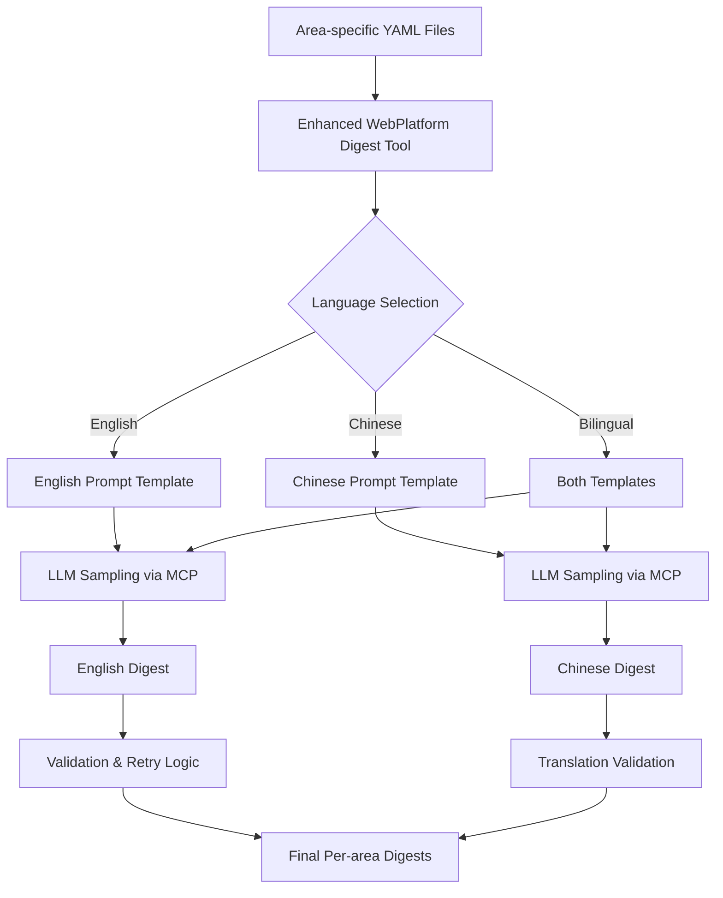
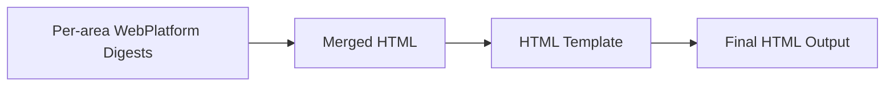

# Technical Overview - Chrome WebPlatform Digest

**Last Updated**: 2025-08-31

## Project Overview

The Chrome WebPlatform Digest is a comprehensive system for processing, analyzing, and generating digests from Chrome WebPlatform release notes. It provides both direct Python script execution and MCP (Model Context Protocol) tool interfaces for accessing its capabilities. The system uses a **configuration-driven, area-splitting pipeline** for precise WebPlatform content processing and multi-language digest generation.

## System Architecture

### Core Components

```
┌─────────────────────────────────────────────────────────┐
│                   MCP Server Layer                       │
│                  (fast_mcp_server.py)                    │
│  ┌─────────────────────────────────────────────────┐    │
│  │  MCP Tools         │  MCP Resources              │    │
│  │  - enhanced_       │  - Processed Release Notes  │    │
│  │    webplatform     │  - Prompts (EN/ZH)          │    │
│  │  - feature_splitter│  - Focus Areas Config       │    │
│  │  - merged_digest   │  - Area-specific YAMLs      │    │
│  │  - release_monitor │  - WebGPU Integration       │    │
│  └─────────────────────────────────────────────────┘    │
└─────────────────────────────────────────────────────────┘
                            │
                            ▼
┌─────────────────────────────────────────────────────────┐
│            Streamlined Processing Architecture           │
│  ┌─────────────────────────────────────────────────┐    │
│  │  Primary Pipeline                               │    │
│  │  - clean_data_pipeline.py                       │    │
│  │  - config-driven via focus_areas.yaml           │    │
│  │  - dual output: markdown + YAML                │    │
│  │  - advanced WebGPU merging & deduplication     │    │
│  │  - seamless MCP integration                    │    │
│  └─────────────────────────────────────────────────┘    │
└─────────────────────────────────────────────────────────┘
                            │
                            ▼
┌─────────────────────────────────────────────────────────┐
│                  Shared Utilities                        │
│  ┌─────────────────────────────────────────────────┐    │
│  │  Core Utils        │  Processing Components      │    │
│  │  - YAML Pipeline   │  - Link Extractor           │    │
│  │  - Focus Area Mgr  │  - Feature Tagging          │    │
│  │  - Area Classifier │  - WebGPU Classifier        │    │
│  │  - Config Manager  │  - Release Monitor          │    │
│  └─────────────────────────────────────────────────┘    │
└─────────────────────────────────────────────────────────┘
                            │
                            ▼
┌─────────────────────────────────────────────────────────┐
│                Structured Data Layer                     │
│  ┌─────────────────────────────────────────────────┐    │
│  │  Input Data        │  Processed Data             │    │
│  │  - Release Notes   │  - Area-specific YAMLs      │    │
│  │  - WebGPU Notes    │  - Tagged Features          │    │
│  │  - Enterprise Docs │  - Bilingual Digests        │    │
│  │                    │  - HTML Output              │    │
│  └─────────────────────────────────────────────────┘    │
└─────────────────────────────────────────────────────────┘
```

### Directory Structure

```
chrome-update-digest/
├── src/
│   ├── mcp_tools/           # MCP tool implementations
│   │   ├── enhanced_webplatform_digest.py  # Main WebPlatform tool
│   │   ├── release_monitor.py              # Release monitoring
│   │   └── feature_splitter.py             # H3 splitting utility
│   ├── processors/          # Processing scripts (STREAMLINED ARCHITECTURE)
│   │   ├── clean_data_pipeline.py          # PRIMARY: Config-driven processor
│   │   ├── split_and_process_release_notes.py  # LEGACY: Deprecated
│   │   └── extract_profile_features.py     # Profile feature extraction
│   ├── utils/              # Shared utilities
│   │   ├── yaml_pipeline.py                # Core YAML processing
│   │   ├── focus_area_manager.py           # Config management
│   │   ├── area_classifier.py              # WebGPU classification
│   │   └── link_extractor.py               # Link extraction
│   └── models/             # Data models
├── config/                 # Configuration files
│   ├── focus_areas.yaml    # Area mapping configuration
│   └── output_configuration.md
├── upstream_docs/
│   ├── release_notes/      # Raw input files
│   │   └── WebPlatform/    # Chrome & WebGPU release notes
│   └── processed_releasenotes/
│       └── processed_forwebplatform/
│           ├── {area}/     # Area-specific directories
│           │   └── chrome-{version}-{channel}.yml
│           └── split_by_heading/  # H2 section splits
├── digest_markdown/        # Generated digests
│   └── webplatform/
│       └── {area}/         # Per-area digests
│           ├── chrome-{version}-{channel}-en.md
│           └── chrome-{version}-{channel}-zh.md
├── prompts/               # AI prompts
│   └── webplatform-prompts/
│       ├── webplatform-prompt-en.md
│       ├── webplatform-prompt-zh.md
│       └── webplatform-translation-prompt-zh.md
└── tests/                # Test suites
```

## New Processing Architecture

### Overview

The system now features **a streamlined processing approach**:

1. **`clean_data_pipeline.py`** (PRIMARY): Configuration-driven, integrates with existing YAML pipeline

### 1. Data Acquisition Pipeline


**Access Methods**:
- **MCP Tool**: `check_latest_releases`, `crawl_missing_releases`
- **Python Script**: `src/processors/monitor_releases.py`

### 2. Primary WebPlatform Processing Pipeline (NEW)



**Key Features**:
- **Configuration-driven**: Uses `config/focus_areas.yaml` for area mapping
- **Sophisticated WebGPU handling**: Three-source merging with deduplication
- **YAML integration**: Works seamlessly with existing `utils/yaml_pipeline.py`
- **Dual output**: Both markdown and YAML formats

**Usage**:
```bash
# Recommended usage
python3 src/processors/clean_data_pipeline.py --version 139 --with-yaml
```


### 3. Digest Generation Pipeline



**Key Features**:
- **Per-area processing**: Each focus area gets its own digest
- **Bilingual support**: English and Chinese output
- **Validation & retry**: Quality assurance with fallback mechanisms
- **Area-specific prompts**: Customized prompts for different technical areas

### 4. Output Generation Pipeline



**Access Methods**:
- **MCP Tool**: `merged_digest_html`
- **Python Script**: `src/convert_md2html.py`

## Capability Access Matrix

| Capability | MCP Tool | Python Script | CLI Command | Status |
|------------|----------|---------------|-------------|--------|
| **Data Acquisition** |
| Check latest releases | ✅ `check_latest_releases` | ✅ `monitor_releases.py` | ✅ | Active |
| Crawl missing releases | ✅ `crawl_missing_releases` | ✅ `monitor_releases.py` | ✅ | Active |
| **WebPlatform Processing (PRIMARY)** |
| Primary processing pipeline | ❌ | ✅ `clean_data_pipeline.py --with-yaml` | ✅ | **PRIMARY** |
| Legacy processing pipeline | ❌ | ✅ `split_and_process_release_notes.py` | ✅ | **DEPRECATED** |
| Generate per-area digests | ✅ `enhanced_webplatform_digest` | ✅ Via MCP | ❌ | **PRIMARY** |
| Generate bilingual digests | ✅ `enhanced_webplatform_digest` | ✅ Via MCP | ❌ | **PRIMARY** |
| **Configuration & Management** |
| Focus areas configuration | ❌ | ✅ `config/focus_areas.yaml` | ❌ | **NEW** |
| Area classification validation | ❌ | ✅ Built into pipelines | ✅ | **NEW** |
| **Utilities** |
| Split features by heading | ✅ `split_features_by_heading` | ✅ `feature_splitter.py` | ❌ | Active |
| Convert MD to HTML | ❌ | ✅ `convert_md2html.py` | ✅ | Active |
| **Output Generation** |
| Generate merged HTML | ✅ `merged_digest_html` | ✅ Via MCP | ❌ | Active |
| Validate extraction | ❌ | ✅ Built into pipelines | ✅ | **NEW** |

### Pipeline Comparison

| Feature | clean_data_pipeline.py | Legacy Pipeline |
|---------|------------------------|-----------------| 
| **Configuration** | ✅ `focus_areas.yaml` (centralized) | ❌ Mixed/scattered |
| **YAML Output** | ✅ Full integration | ✅ Limited |
| **WebGPU Handling** | ✅ Advanced deduplication | ✅ Basic merging |
| **Structure Validation** | ✅ Built-in | ❌ None |
| **MCP Integration** | ✅ Seamless | ✅ Legacy |
| **Flexibility** | ✅ High (config-driven) | ❌ Low (hardcoded) |
| **Maintenance** | ✅ Easy | ❌ Difficult |
| **Recommended Use** | **Production** | **Deprecated** |

## Key Technologies

### Core Frameworks
- **FastMCP 2.0**: MCP server implementation with sampling support
- **YAML Pipeline**: Deterministic feature extraction with 100% link accuracy
- **BeautifulSoup**: HTML parsing for web crawling
- **html2text**: HTML to Markdown conversion

### AI Integration
- **Sampling API**: LLM-based digest generation via MCP sampling
- **Prompt Engineering**: Bilingual (EN/ZH) prompt templates
- **Focus Area Filtering**: Configuration-driven content filtering

### Data Formats
- **Input**: Markdown (release notes), HTML (web sources)
- **Intermediate**: YAML (structured data), JSON (metadata)
- **Output**: Markdown (digests), HTML (formatted output)

## Processing Modes

### 1. Complete Workflow (Recommended)

**Step 1: Process release notes with primary pipeline**
```bash
# Generate both markdown and YAML output by area
python3 src/processors/clean_data_pipeline.py --version 139 --with-yaml
```

**Step 2: Generate digests via MCP server**
```bash
# Start MCP server
python fast_mcp_server.py

# Use MCP client to generate per-area bilingual digests
# The enhanced_webplatform_digest tool will:
# - Load area-specific YAML files
# - Generate English and Chinese digests for each area
# - Apply validation and retry logic
# - Save to digest_markdown/webplatform/{area}/
```

### 2. Standalone Script Mode
Direct Python execution for specific tasks:
```bash
# Enterprise processing
python src/process_enterprise_release_note.py

# Legacy processing (deprecated)
python src/processors/split_and_process_release_notes.py --version 139

# Release monitoring
python src/processors/monitor_releases.py

```

### 3. MCP Server Mode
API-based access for integration with other systems:
```bash
python fast_mcp_server.py
# Then use MCP client to call tools
```

### 4. Hybrid Mode
Combining both approaches for maximum flexibility:
- Use `clean_data_pipeline.py` for initial processing
- Use MCP tools for digest generation
- Share structured YAML data between modes

## Recommended Workflow

### For New Chrome Versions

1. **Data Collection**:
   ```bash
   python src/processors/monitor_releases.py
   ```

2. **WebPlatform Processing** (PRIMARY):
   ```bash
   python3 src/processors/clean_data_pipeline.py --version 139 --with-yaml
   ```
   This generates:
   - `upstream_docs/processed_releasenotes/processed_forwebplatform/{area}/chrome-139-stable.yml`
   - `upstream_docs/processed_releasenotes/processed_forwebplatform/areas/{area}/chrome-139-stable.md`

3. **Digest Generation** (via MCP):
   ```bash
   # Start MCP server
   python fast_mcp_server.py
   
   # Generate per-area bilingual digests
   # Output: digest_markdown/webplatform/{area}/chrome-139-stable-{en|zh}.md
   ```

4. **HTML Generation**:
   ```bash
   python src/convert_md2html.py  # Convert to HTML
   ```

### Key Differences from Legacy Approach

| Aspect | Legacy Approach | WebPlatform Approach |
|--------|----------------|---------------------|
| **Processing** | Single monolithic script | Modular, config-driven WebPlatform pipeline |
| **Output Structure** | Flat file structure | WebPlatform area-based directory hierarchy |
| **Configuration** | Hardcoded in multiple places | Centralized in `focus_areas.yaml` |
| **WebGPU Handling** | Basic merging | Advanced WebGPU deduplication logic |
| **Language Support** | English only | Bilingual WebPlatform with translation validation |
| **Validation** | Manual checking | Built-in WebPlatform validation and retry |
| **Area Classification** | Fixed patterns | Configurable WebPlatform areas with smart fallbacks |

## Configuration

### Environment Variables
```bash
MCP_RESOURCE_MODE=local|remote|hybrid
MCP_CDN_BASE=https://cdn.example.com
SAMPLING_API_KEY=your-api-key
```

### Configuration Files
- `prompts/`: AI prompt templates
- `config/focus_areas.yaml`: Focus area definitions
- `.monitoring/versions.json`: Version tracking

## Performance Characteristics

### Processing Speed
- **Enterprise Processing**: ~2-3 seconds per version
- **WebPlatform Processing**: ~5-10 seconds per version (with WebGPU merge)
- **Digest Generation**: ~10-30 seconds (with AI sampling)

### Resource Usage
- **Memory**: Typical usage 200-500MB
- **Disk**: ~100MB for processed data per Chrome version
- **Network**: Variable based on crawling and AI sampling

## Development Workflow

### Adding New Capabilities

1. **Create Processing Script**:
   - Add to `src/processors/` for standalone scripts
   - Implement core logic with clear interfaces

2. **Create MCP Tool Wrapper**:
   - Add to `src/mcp_tools/`
   - Wrap script functionality for MCP access

3. **Register in MCP Server**:
   - Update `fast_mcp_server.py`
   - Add tool registration and initialization

4. **Add Tests**:
   - Create tests in `tests/`
   - Cover both script and MCP modes

### Testing Strategy

```bash
# Unit tests
pytest tests/test_*.py

# Integration tests
python tests/scripts/test_area_splitting.py

# MCP server tests
python fast_mcp_server.py --test
```

## Future Enhancements

### Planned Features
- [ ] YAML resources via MCP protocol
- [ ] Remote resource hosting (CDN)
- [ ] GraphQL API for resource queries
- [ ] Real-time release monitoring
- [ ] Webhook notifications
- [ ] Multi-language digest generation

### Architecture Evolution
- Microservices architecture for scalability
- Container deployment (Docker/K8s)
- Event-driven processing with message queues
- Distributed caching for performance

## Maintenance

### Regular Tasks
1. **Weekly**: Check for new Chrome releases
2. **Monthly**: Update prompts and keywords
3. **Quarterly**: Review and optimize processing logic
4. **Yearly**: Architecture review and refactoring

### Monitoring
- Processing success rates
- AI sampling costs
- Resource usage trends
- Error rates and patterns

## Support and Documentation

### Documentation
- `/docs/tech_docs/`: Technical documentation
- `/docs/product_docs/`: Product documentation
- `/CLAUDE.md`: Development guidelines
- `/README.md`: Quick start guide

### Debugging
- Check logs in `.monitoring/logs/`
- Validate YAML output in `processed_releasenotes/`
- Test individual tools via MCP protocol
- Run validation scripts in `tests/scripts/`

## Conclusion

The Upstream Digest Server provides a flexible, dual-mode architecture that supports both direct script execution and MCP-based API access. This design enables various use cases from batch processing to real-time digest generation, with a clear separation of concerns and extensible architecture for future enhancements.