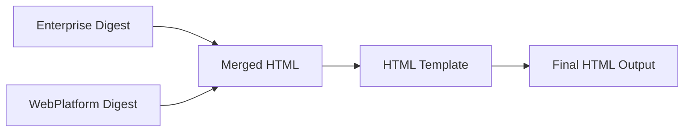

# Technical Overview - Upstream Digest Server

**Last Updated**: 2025-08-15

## Project Overview

The Upstream Digest Server is a comprehensive system for processing, analyzing, and generating digests from Chrome release notes. It provides both direct Python script execution and MCP (Model Context Protocol) tool interfaces for accessing its capabilities.

## System Architecture

### Core Components

```
┌─────────────────────────────────────────────────────────┐
│                   MCP Server Layer                       │
│                  (fast_mcp_server.py)                    │
│  ┌─────────────────────────────────────────────────┐    │
│  │  MCP Tools         │  MCP Resources              │    │
│  │  - enterprise      │  - Processed Release Notes  │    │
│  │  - webplatform     │  - Prompts                  │    │
│  │  - profile         │  - Keywords                 │    │
│  │  - webgpu          │  - YAML Files (planned)     │    │
│  └─────────────────────────────────────────────────┘    │
└─────────────────────────────────────────────────────────┘
                            │
                            ▼
┌─────────────────────────────────────────────────────────┐
│                  Processing Layer                        │
│  ┌─────────────────────────────────────────────────┐    │
│  │  Processors        │  Utilities                  │    │
│  │  - Enterprise      │  - YAML Pipeline            │    │
│  │  - WebPlatform     │  - Link Extractor           │    │
│  │  - WebGPU Merger   │  - Focus Area Manager       │    │
│  │  - Profile Extract │  - Config Manager           │    │
│  └─────────────────────────────────────────────────┘    │
└─────────────────────────────────────────────────────────┘
                            │
                            ▼
┌─────────────────────────────────────────────────────────┐
│                    Data Layer                            │
│  ┌─────────────────────────────────────────────────┐    │
│  │  Raw Data          │  Processed Data             │    │
│  │  - Release Notes   │  - YAML Files               │    │
│  │  - WebGPU Notes    │  - Markdown Digests         │    │
│  │  - Enterprise Docs │  - HTML Output              │    │
│  └─────────────────────────────────────────────────┘    │
└─────────────────────────────────────────────────────────┘
```

### Directory Structure

```
upstream-digest-server/
├── src/
│   ├── mcp_tools/           # MCP tool implementations
│   ├── mcp_resources/       # Resource handlers
│   ├── processors/          # Processing scripts
│   ├── utils/              # Utility modules
│   ├── models/             # Data models
│   └── services/           # Business logic
├── upstream_docs/
│   ├── release_notes/      # Raw input files
│   └── processed_releasenotes/ # Processed output
├── digest_markdown/        # Generated digests
├── digest_html/           # HTML output
├── feature_details/       # Feature splits
├── prompts/              # AI prompts
└── tests/                # Test suites
```

## Processing Pipeline

### 1. Data Acquisition Pipeline


**Access Methods**:
- **MCP Tool**: `check_latest_releases`, `crawl_missing_releases`
- **Python Script**: `src/processors/monitor_releases.py`

### 2. Enterprise Processing Pipeline


**Access Methods**:
- **MCP Tools**: 
  - `process_enterprise_notes` - Process raw notes
  - `extract_profile_features` - Extract profile features
  - `enterprise_digest` - Generate final digest
- **Python Scripts**:
  - `src/process_enterprise_release_note.py`
  - `src/processors/extract_profile_features.py`

### 3. WebPlatform Processing Pipeline


**Access Methods**:
- **MCP Tools**:
  - `merge_webgpu_notes` - Merge WebGPU content
  - `process_webgpu_yaml` - Generate YAML
  - `webplatform_digest` - Generate digest
- **Python Scripts**:
  - `src/merge_webgpu_release_notes_v2.py`
  - `src/processors/process_merged_webgpu.py`
  - `src/utils/yaml_pipeline.py`

### 4. Output Generation Pipeline



**Access Methods**:
- **MCP Tool**: `merged_digest_html`
- **Python Script**: `src/convert_md2html.py`

## Capability Access Matrix

| Capability | MCP Tool | Python Script | CLI Command |
|------------|----------|---------------|-------------|
| **Data Acquisition** |
| Check latest releases | ✅ `check_latest_releases` | ✅ `monitor_releases.py` | ✅ |
| Crawl missing releases | ✅ `crawl_missing_releases` | ✅ `monitor_releases.py` | ✅ |
| **Enterprise Processing** |
| Process enterprise notes | ✅ `process_enterprise_notes` | ✅ `process_enterprise_release_note.py` | ✅ |
| Extract profile features | ✅ `extract_profile_features` | ✅ `extract_profile_features.py` | ✅ |
| Generate enterprise digest | ✅ `enterprise_digest` | ✅ Via MCP | ❌ |
| **WebPlatform Processing** |
| Merge WebGPU notes | ✅ `merge_webgpu_notes` | ✅ `merge_webgpu_release_notes_v2.py` | ✅ |
| Process WebGPU YAML | ✅ `process_webgpu_yaml` | ✅ `process_merged_webgpu.py` | ✅ |
| Generate WebPlatform digest | ✅ `webplatform_digest` | ✅ Via MCP | ❌ |
| **Utilities** |
| Split features by heading | ✅ `split_features_by_heading` | ✅ `feature_splitter.py` | ❌ |
| Convert MD to HTML | ❌ | ✅ `convert_md2html.py` | ✅ |
| Regenerate WebGPU YAMLs | ❌ | ✅ `regenerate_webgpu_yamls.py` | ✅ |
| **Output Generation** |
| Generate merged HTML | ✅ `merged_digest_html` | ✅ Via MCP | ❌ |
| Validate extraction | ❌ | ✅ `validate_extraction.py` | ✅ |

## Key Technologies

### Core Frameworks
- **FastMCP 2.0**: MCP server implementation with sampling support
- **YAML Pipeline**: Deterministic feature extraction with 100% link accuracy
- **BeautifulSoup**: HTML parsing for web crawling
- **html2text**: HTML to Markdown conversion

### AI Integration
- **Sampling API**: LLM-based digest generation via MCP sampling
- **Prompt Engineering**: Bilingual (EN/ZH) prompt templates
- **Focus Area Filtering**: Configuration-driven content filtering

### Data Formats
- **Input**: Markdown (release notes), HTML (web sources)
- **Intermediate**: YAML (structured data), JSON (metadata)
- **Output**: Markdown (digests), HTML (formatted output)

## Processing Modes

### 1. Standalone Script Mode
Direct Python execution for batch processing and automation:
```bash
python src/process_enterprise_release_note.py
python src/merge_webgpu_release_notes_v2.py --version 139
python src/processors/monitor_releases.py
```

### 2. MCP Server Mode
API-based access for integration with other systems:
```bash
python fast_mcp_server.py
# Then use MCP client to call tools
```

### 3. Hybrid Mode
Combining both approaches for maximum flexibility:
- Use scripts for batch processing
- Use MCP tools for on-demand generation
- Share processed data between modes

## Configuration

### Environment Variables
```bash
MCP_RESOURCE_MODE=local|remote|hybrid
MCP_CDN_BASE=https://cdn.example.com
SAMPLING_API_KEY=your-api-key
```

### Configuration Files
- `prompts/`: AI prompt templates
- `config/focus_areas.yaml`: Focus area definitions
- `.monitoring/versions.json`: Version tracking

## Performance Characteristics

### Processing Speed
- **Enterprise Processing**: ~2-3 seconds per version
- **WebPlatform Processing**: ~5-10 seconds per version (with WebGPU merge)
- **Digest Generation**: ~10-30 seconds (with AI sampling)

### Resource Usage
- **Memory**: Typical usage 200-500MB
- **Disk**: ~100MB for processed data per Chrome version
- **Network**: Variable based on crawling and AI sampling

## Development Workflow

### Adding New Capabilities

1. **Create Processing Script**:
   - Add to `src/processors/` for standalone scripts
   - Implement core logic with clear interfaces

2. **Create MCP Tool Wrapper**:
   - Add to `src/mcp_tools/`
   - Wrap script functionality for MCP access

3. **Register in MCP Server**:
   - Update `fast_mcp_server.py`
   - Add tool registration and initialization

4. **Add Tests**:
   - Create tests in `tests/`
   - Cover both script and MCP modes

### Testing Strategy

```bash
# Unit tests
pytest tests/test_*.py

# Integration tests
python tests/scripts/test_area_splitting.py

# MCP server tests
python fast_mcp_server.py --test
```

## Future Enhancements

### Planned Features
- [ ] YAML resources via MCP protocol
- [ ] Remote resource hosting (CDN)
- [ ] GraphQL API for resource queries
- [ ] Real-time release monitoring
- [ ] Webhook notifications
- [ ] Multi-language digest generation

### Architecture Evolution
- Microservices architecture for scalability
- Container deployment (Docker/K8s)
- Event-driven processing with message queues
- Distributed caching for performance

## Maintenance

### Regular Tasks
1. **Weekly**: Check for new Chrome releases
2. **Monthly**: Update prompts and keywords
3. **Quarterly**: Review and optimize processing logic
4. **Yearly**: Architecture review and refactoring

### Monitoring
- Processing success rates
- AI sampling costs
- Resource usage trends
- Error rates and patterns

## Support and Documentation

### Documentation
- `/docs/tech_docs/`: Technical documentation
- `/docs/product_docs/`: Product documentation
- `/CLAUDE.md`: Development guidelines
- `/README.md`: Quick start guide

### Debugging
- Check logs in `.monitoring/logs/`
- Validate YAML output in `processed_releasenotes/`
- Test individual tools via MCP protocol
- Run validation scripts in `tests/scripts/`

## Conclusion

The Upstream Digest Server provides a flexible, dual-mode architecture that supports both direct script execution and MCP-based API access. This design enables various use cases from batch processing to real-time digest generation, with a clear separation of concerns and extensible architecture for future enhancements.